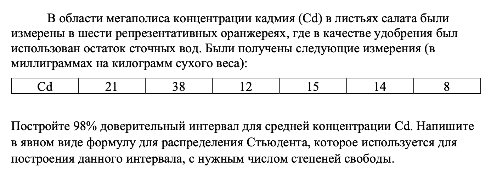
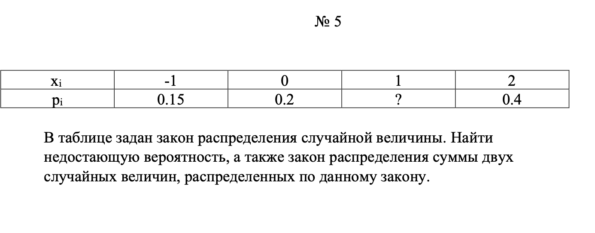

# Демо вариант

## №1

| $Y \backslash X$ | $X = 0$ | $X = 1$ | $X = 2$|
|--------------------|-----------|-----------|-------|
| $Y=1$     | 0.25      | 0.05       | ?|
| $Y=2$         | 0.1     | 0.2       |0.1|

Найти
- недостающую вероятность;
- маргинальные вероятности;
- коэффициент корреляции случайных величин x и y.

---

### Недостающая вероятность

Ну здесь все очевидно, нам необходимо, что сумма всех событий в табличке была равна 1, поэтому:

**Ответ**:  $1 - (0.25+0.05+0.1+0.2+0.1) = 0.3$

| $Y \backslash X$ | $X = 0$ | $X = 1$ | $X = 2$|
|--------------------|-----------|-----------|-------|
| $Y=1$     | 0.25      | 0.05       | 0.3|
| $Y=2$         | 0.1     | 0.2       |0.1|

### Маргинальные вероятности

Маргинальная вероятность - это такая херня в совместном распределении, что нам нужно найти $P(X=x)$ и $P(Y=y)$

$P(X=0) = P(X=0|Y=1) + P(X=0|Y=2) = 0.35$\
$P(X=1) = P(X=1|Y=1) + P(X=1|Y=2) = 0.25$\
$P(X=2) = P(X=2|Y=1) + P(X=2|Y=2) = 0.4$

---
Аналогично для Y:

$P(Y=1) = P(Y=1|X=0) + P(Y=1|X=1) + P(Y=1|X=2)=0.6$\
$P(Y=2) = P(Y=2|X=0) + P(Y=2|X=1) +  P(Y=2|X=2)=0.4$

### Корреляция

$Cor(X, Y) = \frac{Cov(X, Y)}{\sqrt{Var(X)} \cdot \sqrt{Var(Y)}}$

$Cov(X, Y) =E[X, Y] - E[X] E[Y]$\
$Var(Z)=\sum (z_i - E[Z])^2 \cdot P(Z=z_i)$

Считаем:

$E[X] = 0.35 \cdot 0+0.25\cdot1+0.4\cdot2=1.05$\
$E[Y]=0.6 \cdot 1 + 0.4\cdot 2=1.4$\
**P.S. Смотрим на маргинальные вероятности**

$E[X, Y]=1\cdot1\cdot0.05+1\cdot2\cdot0.2+2\cdot1\cdot0.3+2\cdot2\cdot0.1=1.45$\
**P.S. Смотрим на табличку**
| $Y \backslash X$ | $X = 0$ | $X = 1$ | $X = 2$|
|--------------------|-----------|-----------|-------|
| $Y=1$     | 0.25      | 0.05       | ?|
| $Y=2$         | 0.1     | 0.2       |0.1|

$Var[X]=(0-1.05)^2\cdot0.35+(1-1.05)^2\cdot0.25+(2-1.05)^2\cdot0.4=0.7475$\
$Var[Y]= ... =0.24$

$Cov(X,Y)=1.45 - 1.05 \cdot 1.4=-0.02$

Считаем корреляцию:

$Cor(X,Y)=\frac{-0.02}{\sqrt{0.7475}\cdot \sqrt{0.24}}\approx -0.0472$

## №2

$$
f(x) = \begin{cases} 
C\lvert 2x + 3 \rvert, & -3 < x < -1 \\
0, & x \leq -3 \text{ или } x \geq -1 
\end{cases}
$$

Найти:
- Константу $C$;
- Функцию распределения $F(X)$.
- Математическое ожидание $E(X)$.
- Дисперсию $Var(X)$.
- Вероятность $P(-2 < X < 5)$.

---

### Константа $C$

В этом задании нам будет дана (я так думаю) функция плотности вероятности. Вот главное, что нужно про нее знать:

$\int_{-\infty}^{\infty} f(x) dx = 1$\
В силу условия:\
$\int_{-3}^{-1} C\lvert 2x + 3 \rvert dx = 1$\
Тогда:\
$-C\int_{-3}^{-\frac{3}{2}}2x + 3 dx + C\int_{-\frac{3}{2}}^{-1} 2x + 3 dx=1$\
$\frac{9}{4}C+\frac{1}{4}C=1$\
$C=0.4$

### Функция распределения $F(X)$

Функция распределения - это такая штука, что:\
$F(X)= \int_{-\infty}^{x} f(t) \, dt$

Наша задача состоит в том, чтобы на разных промежутках найти ее значения. Так, мы имеем, что:

1) $$F(X \leq -3)=0$$

2) $-3 < x \leq -\frac{3}{2}$:

$$F(x) = \int_{-3}^{x} \frac{2}{5} (-2t - 3) \, dt = \left( -\frac{2}{5}t^2 - \frac{6}{5}t \right)_{-3}^{x} = -\frac{2}{5}x^2 - \frac{6}{5}x$$

3) $-\frac{3}{2} < x \leq -1$:

$$F(x) = \frac{9}{10} + \int_{-\frac{3}{2}}^{x} \frac{2}{5} (2t + 3) \, dt = \frac{9}{10} + \left( \frac{2}{5}t^2 + \frac{6}{5}t \right)_{-\frac{3}{2}}^{x} = \frac{2}{5}x^2 + \frac{6}{5}x + \frac{9}{5}$$

P.S $\frac{9}{10}$ берется от того, что мы в предыдущий интеграл засунули значение $-\frac{3}{2}$.

4) $F(X > -1)=1$

Итого:

$$F(x) = \begin{cases} 
0, & x \leq -3 \\
-\frac{2}{5}x^2 - \frac{6}{5}x, & -3 < x \leq -\frac{3}{2} \\
\frac{2}{5}x^2 + \frac{6}{5}x + \frac{9}{5}, & -\frac{3}{2} < x \leq -1 \\
1, & x > -1 
\end{cases}$$

### Матожидание

В предыдущем задании мы нашли, что:\
$f(x)=0.4\cdot\lvert 2x+3 \rvert$\
Матожидание в таком случае:\
$E[X]=\int_{-\infty}^{\infty} xf(x) \, dx$\
$E[X]=\int_{-3}^{-\frac{3}{2}} -0.4(2x+3) \, dx +\int_{-\frac{3}{2}}^{-1}0.4(2x+3) \, dx =-\frac{71}{30}$

### Дисперсия

$Var[X] = E[X^2]-[E[X]]^2$\
$\text{Главное, что:  } \\ E[X^2]= \int_{-\infty}^{\infty} x^2f(x) \, dx = \frac{47}{8}
$\
$Var[X] = \frac{47}{8} - (\frac{71}{30}) ^ 2 \approx 0.2738$

### Вероятность $P(-2 < X < 5)$

Просто берем нашу функцию плотности вероятности и считаем:

$\int_{-2}^{-1}0.4\cdot\lvert 2x+3 \rvert\,dx=0.2$\
P.S Берем до -1, так как дальше $f(x)=0$
## №3

Каждый клиент покупает с равной вероятностью от 300 до 1500 г черешни.
Если в магазин за сутки пришло 100 покупателей и в наличии имеется 95 кг
черешни, то с какой вероятностью она закончится?

---

У нас имеется равномерное распределение, поэтому ссылаемся на него. Пусть:

$a=300\,\,b=1500 \,\,\text{   Тогда:}$\
$E[X] = \frac{a + b}{2} = 900$\
$Var(X) = \frac{(b - a)^2}{12} = 120 000$\
$Std(X) = \sqrt{Var(X)} = 346.41016$

Так как клиенты независимы, что найдем параметры для них:

$E[Clients] =  900 \cdot n = 90000$\
$Var(Clients) = 120 000 \cdot n = 120 00000$\
$Std(Clients) = \sqrt{Var(X) \cdot n} = 3464.1016$\

Дабы ползоваться таблицей нормлаьного распределения, то нам необходимо стандартизировать величины под стандартное нормальное распределение:

$Z = \frac{S - E(S)}{Var(Clients)} = \frac{S - 90000}{3464.1}$\
$\text{где: } S = 95 000 г$\
$Z =  \frac{95000 - 90000}{3464.1} = 1.44338$ 

Тогда черешня закончится при:

$P(Z > 1.44338) = 1 - P(Z \leq1.4438) \approx 0.0743$

P.S. $P(Z \leq1.4438)$ значение мы ищем в таблице нормального распределения.

## №4

---

Размер выборки: 
$n = 6$ 

Выборочное среднее: 
$\bar{X} = \frac{21 + 38 + 12 + 15 + 14 + 8}{6}=18$

Выборочная дисперсия: 
$\bar{\sigma^2} = \sum{\frac{(x_i - \bar{X}) ^ 2}{n - 1}} = 114$

Доверительный интервал: 
$\bar{X} \pm t_{\alpha/2, n -1} \cdot \frac{\sqrt{\sigma^2}}{\sqrt{n}}$\
Где (n - 1) - степени свободы

Далее мы просто смотрим на табличку и ищем значение: 
$t_{\alpha/2, n -1} = 3.365$

Тогда доверительный интервал:\
[3.33231,   32.66769]

## №5

1) Недостающая вероятность: 0.25
2) Закон распределения сумм не очень приятен, так как придется делать много расчетов, но сутье его такова, что:

$$P(Z = x_1+x_2) = \sum_{x_1 + x_2} P(X_1 = x_1) \cdot P(X_2 = x_2)$$ 

Ну всевозможные суммы это {$-2, -1,0,1,2,3,4$}

Дальше мы просто дрочимся с расчетами и в итоге получаем:

| $x_1 + x_2$ | -2      | -1   | 0     | 1    | 2      | 3    | 4    |
|---------|---------|------|-------|------|--------|------|------|
| $P(Z = x_1+x_2)$ | 0.0225 | 0.06 | 0.115 | 0.22 | 0.2225 | 0.2  | 0.16 |
